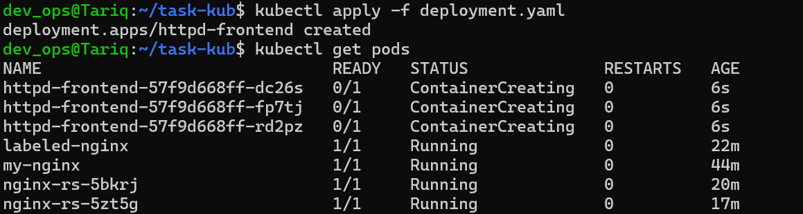

# My Kubernetes Task Notes

This file shows the steps I took to complete the Kubernetes task.

---
## Part 1: Kubernetes Steps

### 1. Create pod `my-nginx` with a command
Here I'm creating the `my-nginx` pod directly.

```bash
dev_ops@Tariq:~$ kubectl run my-nginx --image=nginx
pod/my-nginx created
```


---
### 2. Create pod with bad image `nginx123`
Trying to create a pod with an image that doesn't exist.

```bash
dev_ops@Tariq:~$ kubectl run my-nginx-command --image=nginx123
pod/my-nginx-command created
```


---
### 3. Check pod status and find the error
The pod is stuck in `ImagePullBackOff`. The `describe` command shows it's because the `nginx123` image was not found.

```bash
dev_ops@Tariq:~$ kubectl get pod my-nginx-command
NAME                 READY   STATUS             RESTARTS   AGE
my-nginx-command     0/1     ImagePullBackOff   0          50s

dev_ops@Tariq:~$ kubectl describe pod my-nginx-command
...
Events:
  Type     Reason     Age                  From               Message
  ----     ------     ----                 ----               -------
  Warning  Failed     52s (x4 over 2m13s)  kubelet            Failed to pull image "nginx123": rpc error: code = Unknown desc = repository nginx123 not found...
```


---
### 4. Get pod IP and node name
Using `get pod -o wide` to find the IP and the node for the `my-nginx` pod.

```bash
dev_ops@Tariq:~$ kubectl get pod my-nginx -o wide
NAME       READY   STATUS    RESTARTS   AGE   IP           NODE       NOMINATED NODE   READINESS GATES
my-nginx   1/1     Running   0          5m    172.17.0.4   minikube   <none>           <none>
```


---
### 5. Delete the pod
Deleting the broken pod.

```bash
dev_ops@Tariq:~$ kubectl delete pod my-nginx-command
pod "my-nginx-command" deleted
```


---
### 6. Create pod from YAML file with a label
Making a new pod from a YAML file this time.

* **`pod.yaml` file:**
    ```yaml
    apiVersion: v1
    kind: Pod
    metadata:
      name: labeled-nginx
      labels:
        app: webserver
    spec:
      containers:
      - name: nginx-container
        image: nginx
    ```

* **Command:**
    ```bash
    dev_ops@Tariq:~$ kubectl apply -f pod.yaml
    pod/labeled-nginx created
    ```


---
### 7. Create a ReplicaSet with 3 replicas
Creating a ReplicaSet to keep 3 nginx pods running.

* **`replicaset.yaml` file:**
    ```yaml
    apiVersion: apps/v1
    kind: ReplicaSet
    metadata:
      name: nginx-rs
    spec:
      replicas: 3
      selector:
        matchLabels:
          app: nginx-pods
      template:
        metadata:
          labels:
            app: nginx-pods
        spec:
          containers:
          - name: nginx
            image: nginx
    ```

* **Command:**
    ```bash
    dev_ops@Tariq:~$ kubectl apply -f replicaset.yaml
    replicaset.apps/nginx-rs created

    dev_ops@Tariq:~$ kubectl get pods
    NAME             READY   STATUS    RESTARTS   AGE
    nginx-rs-5qg6l   1/1     Running   0          25s
    nginx-rs-h7j8x   1/1     Running   0          25s
    nginx-rs-t9v2f   1/1     Running   0          25s
    ```


---
### 8. Scale replicas to 5
Scaling the ReplicaSet up to 5 pods without changing the file.

```bash
dev_ops@Tariq:~$ kubectl scale replicaset nginx-rs --replicas=5
replicaset.apps/nginx-rs scaled

dev_ops@Tariq:~$ kubectl get pods
# Output shows 5 pods running
```


---
### 9. Test self-healing
I deleted one of the 5 pods. The ReplicaSet automatically created a new one to replace it.

```bash
dev_ops@Tariq:~$ kubectl delete pod nginx-rs-5qg6l
pod "nginx-rs-5qg6l" deleted

dev_ops@Tariq:~$ kubectl get pods
# Output shows the old pod 'Terminating' and a new one being created
```


---
### 10. Scale down to 2 pods using `edit`
Used `kubectl edit` to change the replicas from 5 to 2.

* **Command:**
    ```bash
    dev_ops@Tariq:~$ kubectl edit replicaset nginx-rs
    ```
[screenshot of the editor showing `replicas: 2`]

* **Result:**
    ```bash
    replicaset.apps/nginx-rs edited

    dev_ops@Tariq:~$ kubectl get pods
    # Output now shows only 2 pods
    ```


---
### 11-13. Find issues in YAML files

* **YAML 1 Issue:** The `selector` (`tier: frontend`) doesn't match the pod `labels` (`tier: nginx`).
* **YAML 2 Issue:** `kind` is `deployment` (lowercase), but it needs to be `Deployment` (uppercase).
* **YAML 3 Issue:** `apiVersion` is `v1`, but for a Deployment it must be `apps/v1`.

---
### 14. Find the image name of a deployment
The command to find the image is `kubectl describe deployment <name>`.

```bash
dev_ops@Tariq:~$ kubectl describe deployment httpd-frontend

```


---
### 15. Create a Deployment
Creating an `httpd` deployment with 3 replicas.

* **`deployment.yaml` file:**
    ```yaml
    apiVersion: apps/v1
    kind: Deployment
    metadata:
      name: httpd-frontend
    spec:
      replicas: 3
      selector:
        matchLabels:
          app: httpd
      template:
        metadata:
          labels:
            app: httpd
        spec:
          containers:
          - name: httpd
            image: httpd:2.4-alpine
    ```

* **Command:**
    ```bash
    dev_ops@Tariq:~$ kubectl apply -f deployment.yaml
    deployment.apps/httpd-frontend created
    ```



---
### 16. Update a Deployment's image
Changing the image to a bad one (`nginx777`) to test rollback.

```bash
dev_ops@Tariq:~$ kubectl set image deployment/httpd-frontend httpd=nginx777
deployment.apps/httpd-frontend image updated
```


---
### 17. Rollback a Deployment
Rolling back the failed update to the previous working version.

```bash
dev_ops@Tariq:~$ kubectl rollout undo deployment/httpd-frontend
deployment.apps/httpd-frontend rolled back
```


---
### 18. Create a Custom Web App with Docker
Built a custom nginx image and pushed it to my Docker Hub.

* **`Dockerfile`:**
    ```dockerfile
    FROM nginx:alpine
    COPY ./index.html /usr/share/nginx/html/index.html
    ```
* **Commands:**
    ```bash
    # (Replaced my username with a placeholder)
    docker build -t my-custom-app .
    docker tag my-custom-app tariq126/my-custom-app:1.0
    docker push tariq126/my-custom-app:1.0
    ```


---
### 19. Deploy the Custom Image to Kubernetes
Deploying the custom image from my Docker Hub account.

* **`custom-app-deployment.yaml` file:**
    ```yaml
    apiVersion: apps/v1
    kind: Deployment
    metadata:
      name: custom-web-app
    spec:
      replicas: 3
      selector:
        matchLabels:
          app: my-app
      template:
        metadata:
          labels:
            app: my-app
        spec:
          containers:
          - name: web-container
            image: tariq126/my-custom-app:1.0
            ports:
            - containerPort: 80
    ```

* **Command:**
    ```bash
    dev_ops@Tariq:~$ kubectl apply -f custom-app-deployment.yaml
    deployment.apps/custom-web-app created
    ```

